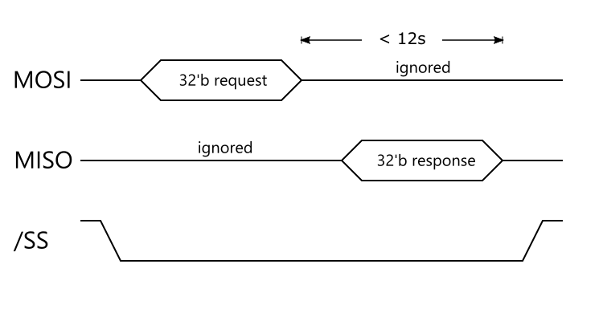

Pot client - RTS SPI Protocol
=============================

iPot DevDoc 001

This document describes serial communication between the pot client and its realtime subsystem.

1. Introduction
---------------

**1.1. Background**

While the pot side of iPot system typically consists a Raspberry Pi 3B with Linux, it cannot guarantee to be reliable for collecting real world sensor data (Linux provides RT_PREEMPT). Furthermore, many sort of sensors, watering and lighting features came out that they have level/shifting issues.

The client *realtime subsystem*, or client RTS for short, is added to solve these issues. Client RTS manages the physical subsystem in real time, running a designated AVR series microprocessor on a specially designed circuit board.

**1.2. SPI**

Communication between the pot client and RTS is suggested to be run over a duplex serial communication channel called *serial peripheral interface bus* or SPI.

SPI is not a well-designed reliable communication channel, but rather a face-to-face sequential bit-shifting registers with clock edge and enable signal. Therefore it has no slave acknowledgement, no flow control from slave, no parity check.

For details, see [Wikipedia article on SPI](https://en.wikipedia.org/wiki/Serial_Peripheral_Interface_Bus).

2. Timing
---------

3. Payload
----------

**3.1. Request**

fixed width 32bit

* **V**: version. must be 0.
* **W**: write to device. (0: read, 1: write)
* **R**: reserved. must be 0.
* **RID**: request id. arbitrary.
* **DID**: device id. described in Section 4.
* **data**: read operation parameter, or data to write to device.

**3.2. Response**

fixed width 32bit

* **V**: version. must be 0.
* **OK**: result ok from RTS. (0: ok, 1: bad)
* **R**: reserved. must be 0.
* **RID**: request id. same value as the corresponding request it follows.
* **DID**: device id. described in Section 4.
* **data**:
  * if OK is ok, the read data (req W=r) or the written data (req W=w).
  * if OK is bad, ERRNO, described in Section 5.

4. Device
---------

TBD.

5. Error
--------

TBD.
